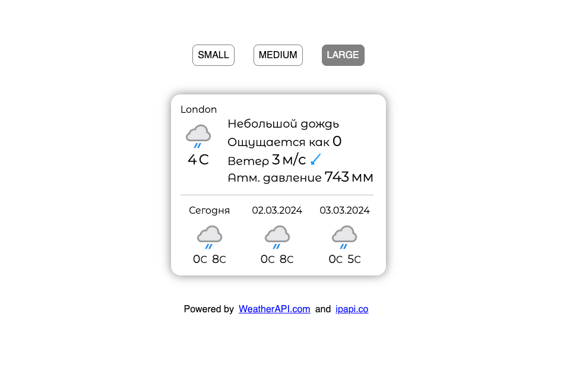
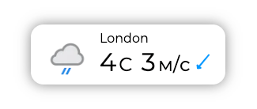
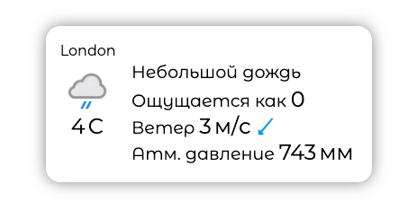
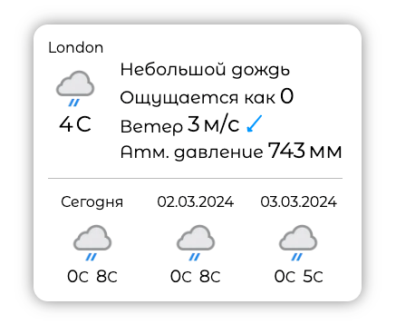

# Weather widget (React, Typescript)

---


---



---

## Scripts

```bash
# Start the development server
npm run dev
```

```bash
# Build for production
npm run build
```

```bash
# Preview the build
npm run preview
```

```bash
# Formats your code and automatically fix any linting errors
npm run lint
```
---

## UI-component Weather

The application receives weather from [weatherapi.com](https://www.weatherapi.com/), coordinates from [ipapi.co](https://ipapi.co/).

---





